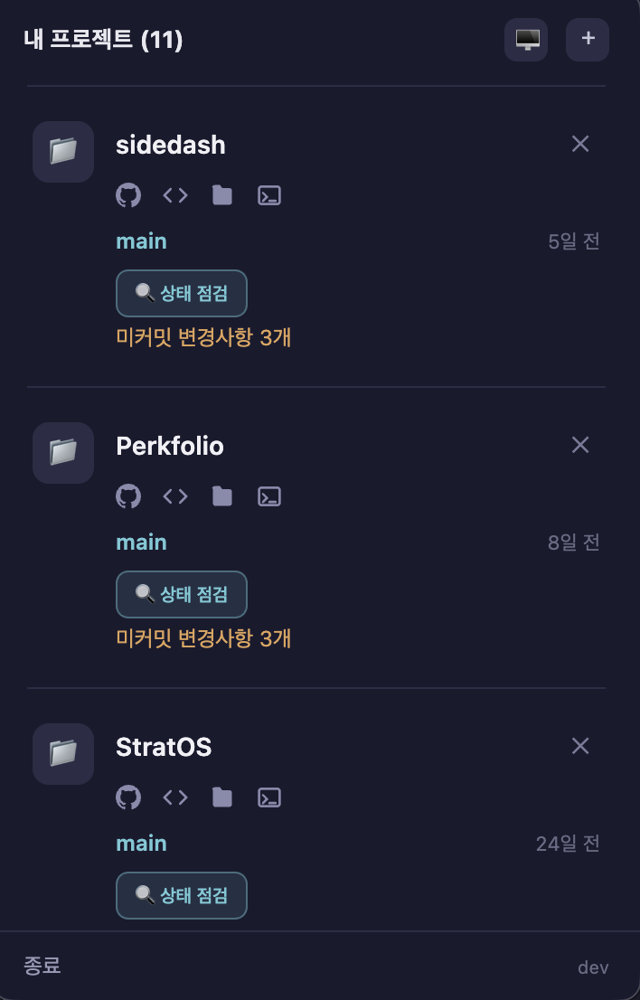
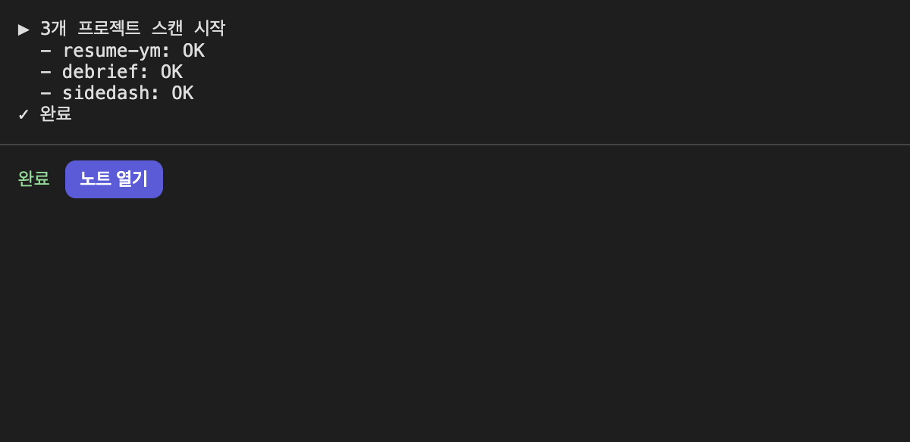

# sidedash

개인 사이드 프로젝트용 CLI 도구들을 매번 터미널에서 명령어를 기억해 실행하는 대신,
macOS 메뉴바에서 버튼 클릭으로 실행할 수 있게 해주는 개인용 Electron 대시보드입니다.

배포를 목표로 하지 않는 개인 전용 도구로, 코드사이닝/노터라이제이션/자동 업데이트/App Store
배포는 스코프에서 제외되어 있습니다.



## 왜 만들었나

사이드 프로젝트를 여러 개 굴리다 보니, 정작 코드보다 "이 프로젝트 실행 명령어가 뭐였더라",
"어느 브랜치였지", "커밋 안 한 게 있었나"를 떠올리는 데 시간이 더 들었습니다. 이 재진입 비용을
줄이려고 트레이 아이콘 하나로 모든 사이드 프로젝트의 상태를 한눈에 보고, 버튼 클릭 한 번으로
각자의 실행 스크립트를 돌릴 수 있는 도구를 만들었습니다. 여러 도구를 하나로 통합하는 대신,
각 프로젝트의 기존 CLI/스크립트를 그대로 실행만 시켜주는 얇은 레이어로 설계했습니다.

## 주요 기능

- Dock 아이콘 없이 메뉴바 트레이 아이콘으로만 상주 (`menubar` 패키지 사용)
- 트레이 클릭 시 등록된 프로젝트 카드 목록을 팝업으로 표시 (팝업을 다시 열 때마다 최신 git
  상태로 새로고침)
  - 카드에는 브랜치, 마지막 커밋, 마지막 실행 시각("N일 전")이 표시됩니다
  - 제목 아래 아이콘 줄로 GitHub(원격 저장소가 있을 때)/VS Code/Finder/cmux에서 바로 열기
  - 헤더의 정렬 토글로 최근순/이름순 전환 가능 (앱 재시작 시 최근순으로 초기화)
- 미커밋 변경사항이 있는 프로젝트는 "미커밋 변경사항 N개"가 표시되고, 카드를 클릭하면
  `git status --porcelain` 스타일의 변경 파일 목록이 펼쳐집니다 (변경사항이 없는 카드는 클릭에
  반응하지 않음)
- ＋ 버튼으로 새 프로젝트 폴더를 등록, ✕ 버튼으로 제거
- 프로젝트 루트 파일 존재 여부에 따라 액션 버튼을 자동 감지
  - `run.sh`가 있으면 "파이프라인 실행" 버튼 (예: debrief)
  - `package.json`의 `scripts.pdf`가 있으면 "PDF 생성" 버튼 (예: resume-ym)
- 액션 실행 시 별도 로그 창을 열어 stdout/stderr를 실시간 스트리밍

  

- 실행 중인 프로젝트는 버튼이 비활성화되어 중복 실행 방지
- 액션 완료(성공/실패) 시 macOS 알림이 뜨고, 클릭하면 로그 창으로 포커스 이동
- 실행 중인 작업이 있는 상태에서 앱을 종료하려 하면 확인 다이얼로그를 띄우고, 확인 시
  해당 프로세스 트리 전체(로그인 셸 + 그 하위 프로세스)를 정리한 뒤 종료

## 데이터 레이어

프로젝트 레지스트리는 `src/lib/registry.js`(등록/조회/삭제)와 `src/lib/scanner.js`(git 브랜치/
최근 커밋/미커밋 변경 여부/GitHub URL)가 담당하며, `~/.pj/registry.json`에 저장합니다. 원래
reentry-cli라는 별도 CLI 도구의 로직을 재사용하던 부분인데, sidedash를 독립적으로 설치·실행할
수 있도록 필요한 함수만 이 저장소 안으로 가져왔습니다 — 같은 파일 포맷을 그대로 쓰기 때문에
reentry-cli의 `pj` 명령어와 여전히 레지스트리를 공유할 수 있습니다.

## 요구 사항

- macOS
- Node.js

## 시작하기

```bash
npm install
npm start
```

## 테스트

```bash
npm test
```

순수 로직(액션 감지, 실행 커맨드 조립 등)은 vitest 유닛 테스트로 커버되어 있습니다.
Electron UI(트레이 팝업, 로그 창)는 자동화 테스트 없이 직접 실행해 수동으로 확인합니다.

## 프로젝트 구조

```
src/
├── main.js              # Electron 메인 프로세스, 메뉴바/IPC 설정
├── preload.cjs          # 렌더러 프리로드 스크립트
├── index.html           # 트레이 팝업 UI
├── logwindow.html/.js   # 액션 실행 로그 창
├── renderer/app.js      # 팝업 렌더러 로직
├── actions/
│   ├── detect.js        # run.sh / pdf 스크립트 존재 여부로 액션 타입 감지
│   ├── run.js           # spawn으로 액션 실행(detached), 실시간 로그 스트리밍, 프로세스 트리 정리
│   ├── git.js           # git status --porcelain 파싱 (미커밋 파일 목록)
│   └── history.js       # 마지막 실행 시각 기록/조회 (userData/last-run.json)
├── ipc/
│   └── projects.js      # 프로젝트 카드 조회(git 상태/최근 실행/GitHub URL), 중복 등록 방지
└── lib/
    ├── registry.js      # 프로젝트 등록/조회/삭제 (~/.pj/registry.json)
    └── scanner.js       # git 브랜치/커밋/GitHub URL, package.json scripts 조회
```

## 스코프 밖

- 코드사이닝/노터라이제이션/자동 업데이트/App Store 배포
- 정렬 순서 영구 저장 (앱 재시작 시 항상 최근순으로 초기화)
- 로그 히스토리 저장 (창을 닫으면 마지막 로그는 다시 볼 수 없음)
- `run.sh`, `pdf` 스크립트 외 다른 자동 액션 감지 규칙

더 자세한 설계 배경은 [`docs/superpowers/specs/2026-07-22-menubar-dashboard-design.md`](docs/superpowers/specs/2026-07-22-menubar-dashboard-design.md)를 참고하세요.
