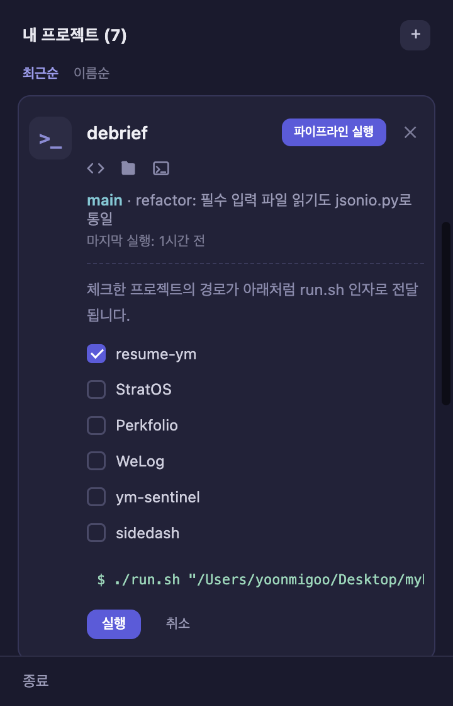

# sidedash

macOS 메뉴바에서 여러 사이드 프로젝트의 상태를 확인하고 기존 실행 스크립트를 그대로 실행할 수 있는 개인용 Electron 대시보드입니다.

<p align="center">
  
</p>

## Tech Stack

| Category | Tech |
|----------|------|
| Framework | Electron |
| Language | TypeScript |
| Build | electron-vite |
| Test | Vitest |

## 왜 만들었나

여러 사이드 프로젝트를 동시에 진행하다 보니, 매번 터미널을 열어 프로젝트를 찾고 실행 명령어를 입력하거나 브랜치 상태를 확인하는 재진입 비용이 코드 작성 자체보다 커졌습니다.

이 재진입 비용을 줄이기 위해 메뉴바에서 프로젝트 상태를 한눈에 확인하고, 기존 스크립트를 그대로 실행할 수 있는 가벼운 런처를 만들었습니다.

## 주요 기능

**프로젝트 관리**
- 아이콘 클릭 시 프로젝트 목록 표시, 열 때마다 Git 상태 새로고침
- GitHub / VS Code / Finder / cmux 바로 열기, 최근순 / 이름순 정렬
- 미커밋 변경 사항 표시, 클릭 시 변경 파일 목록 펼침
- ＋ / ✕ 버튼으로 등록 및 제거

**액션 실행**
- `run.sh` → "파이프라인 실행" (대상 프로젝트 선택 → 인자 전달 → 실행 명령 미리보기)
- `package.json`의 `scripts.pdf` → "PDF 생성"
- 로그 창에서 stdout / stderr 실시간 스트리밍
- 완료 시 성공/실패 표시, 성공 시 결과 폴더 여는 버튼 + macOS 알림
- 실행 중인 프로젝트는 버튼 비활성화로 중복 실행 방지, 종료 시도 시 확인 다이얼로그 후 정리

<p align="center">
  
  
</p>

## 데이터 레이어

프로젝트 레지스트리는 `src/main/lib/registry.ts`에서 관리하며 `~/.pj/registry.json`에 저장됩니다.

Git 정보(브랜치, 마지막 커밋, GitHub URL)는 `src/main/lib/scanner.ts`에서 수집합니다.

레지스트리 포맷은 reentry-cli와 동일하며, 필요한 로직만 가져와 `pj` 명령어와 프로젝트 목록을 공유합니다.

## 요구 사항

- macOS
- Node.js

## 시작하기

```bash
npm install
npm start
```

`electron-vite dev`를 실행합니다.

렌더러는 Hot Reload를 지원하며, main / preload 프로세스는 변경 시 자동으로 재시작됩니다.

## 앱으로 패키징

```bash
npm run package
```

`dist/sidedash-darwin-arm64/sidedash.app`이 생성됩니다.

Applications 폴더로 이동하거나 Dock에 고정해 사용할 수 있습니다.

서명 없이 배포되는 개인용 도구이므로 처음 실행할 때 macOS의 **"확인되지 않은 개발자"** 경고가 나타납니다. Finder에서 우클릭 → **열기**를 선택하면 실행할 수 있습니다.

### 로그인 시 자동 실행

패키징된 앱은 실행 시 로그인 항목에 자동 등록됩니다.

`시스템 설정 → 일반 → 로그인 항목`에서 확인하거나 해제할 수 있으며, 앱을 다른 위치로 옮기면 새 위치로 다시 등록됩니다.

## 테스트

```bash
npm test           # Vitest
npm run typecheck  # tsc -b --noEmit
```

순수 로직은 Vitest로 테스트합니다.

Electron UI는 자동화 테스트 대신 수동으로 검증합니다.

## 프로젝트 구조

```text
src/
├── main/
│   ├── index.ts          # Electron 메인 프로세스, 메뉴바/IPC 설정
│   ├── logwindow.ts      # 로그 창 BrowserWindow 생성/관리
│   ├── actions/
│   │   ├── detect.ts     # run.sh / pdf 스크립트 감지
│   │   ├── run.ts        # 액션 실행, 로그 스트리밍, 프로세스 트리 정리
│   │   ├── git.ts        # git status --porcelain 파싱
│   │   └── history.ts    # 마지막 실행 시각 관리
│   ├── ipc/
│   │   └── projects.ts   # 프로젝트 조회, 등록, 삭제 IPC
│   └── lib/
│       ├── registry.ts   # 프로젝트 등록/조회/삭제
│       └── scanner.ts    # Git 정보 및 package.json 스캔
├── preload/
│   ├── index.ts
│   └── logwindow.ts
├── renderer/
│   ├── index.html / src/app.ts
│   └── logwindow.html / src/logwindow.ts
└── shared/
    └── types.ts

resources/                 # 메뉴바 아이콘 등 런타임 리소스
electron.vite.config.ts    # main / preload / renderer 빌드 설정
```

